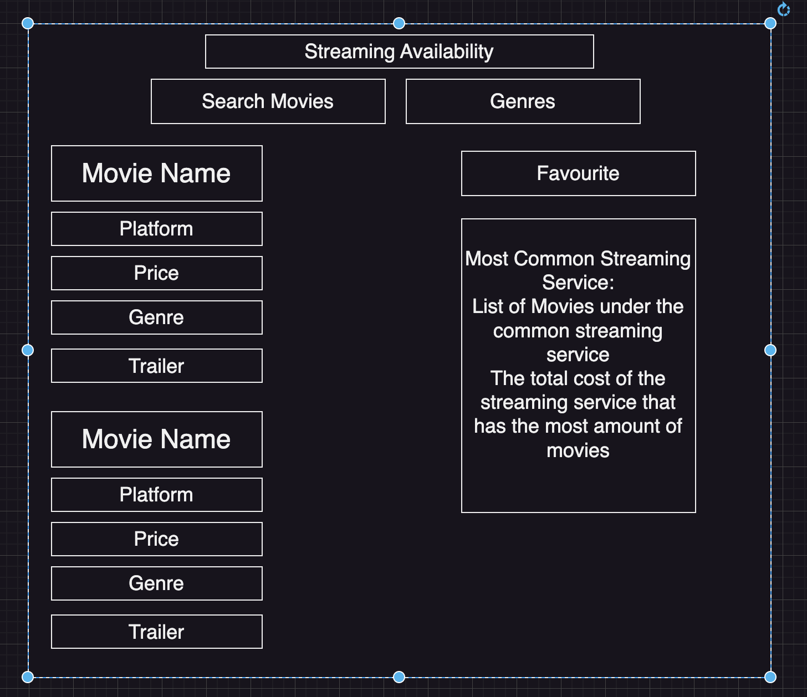

# Streaming-Availability

## About the App
This app is a place where you can search a movie or tv show you want to see and it will show you which streaming services has those movies and T.V shows. It will let you know the price of the streaming service in a monthly subscription. Furthermore, if you add more than 1 movie, lets just say 5 movies, it will show the streaming service that has the most amount of movies, and give you the best value for it, so you save more money.

## Planning and Problem Solving

My initial plan on the first day is in the picture below
	

I wanted to create an app where you can search movies and tv shows by title and genre, and will display certain information about those movies and tv shows, such as the trailer, and the streaming services the streaming services these shows and movies was available in. It will also display the price as well.

## Cool Tech
We used programming languages such as javascipt, react, css, and html to make this app.

## Bugs to Fix
There is no scrolling function, so after it adds a certain amount of movies and shows and streaming services, the bottom og the list can't be seen. Another bug is that it only filters by genres after you have typed in the name of the movie or shows in the searchbar, which is definiltely a limitation, as I would have liked it to return a bunch of movies and shows that are, for example in the drama genre, rather than just search by title, and then only being able to filter by genre.

## Lessons Learnt
The lesson I learnt from this app is the usability of react, and how different and coder friendly it is to code projects with, and now I cam see why everyone likes learning. I also learnt to be extra careful with API keys, and ensuring they are in an .env file rather than your code when it is pushed up to github, especially ones where you have paid for the API, as to not risk security breaches, as anyone reading github can just go looking around for it and find the payment details I used to purchase the API Key. Also, make sure the .env file should be in the git ignore file so it doesn't get pushed to git hub as well.

## Future Features
I would like to add a scroll function that lets us scroll to the bottom of the favourites, so it shows more streaming services and etc. Kind of similar to what we did the giphy tasks. I would also like to add a feature where you can search just by genre without inputting the title.